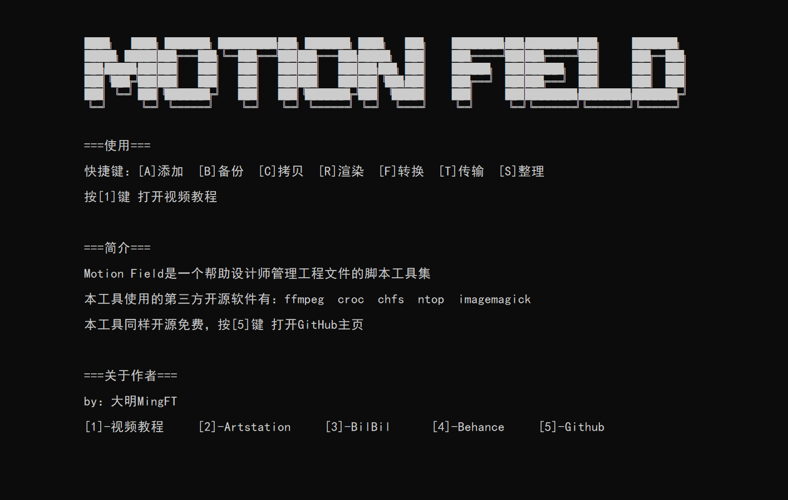

# Motion Field

Motion Field是一个帮助设计师管理工程文件的脚本工具集

---

## ✨使用教程✨
https://www.bilibili.com/video/BV11U4y1u7xG

## ✨使用✨

- 创建你的工程文件夹

- 将【Z_Motion_Field】文件夹解压到你的工程

- 双击打开【Motion_Field.bat】

- 按下0键，部署工程。
  按下H键，查看帮助。

windows 22H2 以上版本，需要到终端中设置一下 ： 设置→启动→默认终端应用程序→Windows控制台主机

## ✨功能展示✨

#### ✔一键部署  工程目录

#### ✔一键 快速打开文件夹

#### ✔一键备份  整个工程

#### ✔Blender批量渲染

#### ✔视频＆图片 格式转换

#### ✔点对点 大文件传输

## ✨使用到的 第三方工具✨

[ffmpeg](http://ffmpeg.org/)

[croc](https://github.com/schollz/croc)

[chfs](http://iscute.cn/chfs)

[ntop](https://github.com/gsass1/NTop)

[imagemagick](https://imagemagick.org/)
