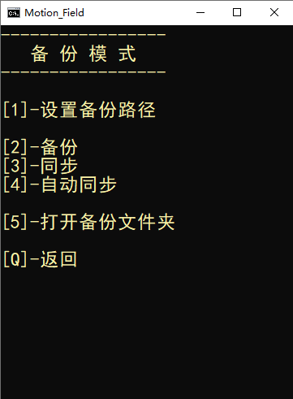
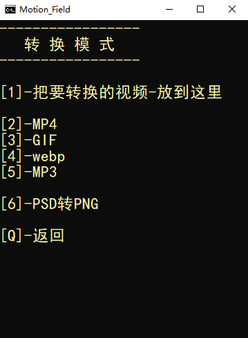
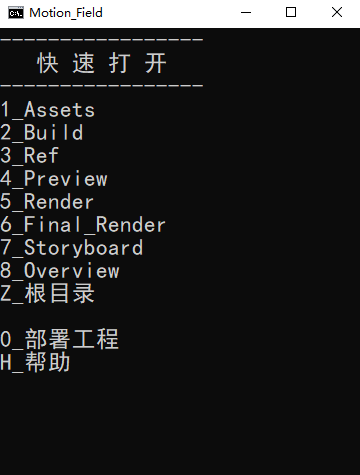
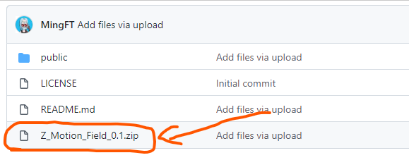
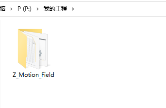
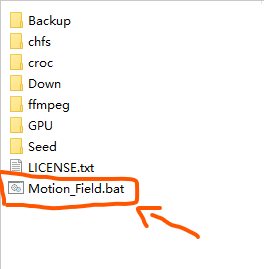
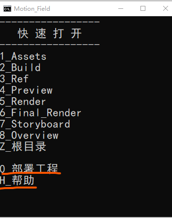

# Motion Field【動態領域】

Motion Field是一个帮助设计师管理工程文件的脚本工具集

---

## ✨下载✨

直接下载这个压缩包即可

压缩包名字最后带有版本号，例如_0.1

下载最新的版本即可

## ✨使用✨

- 创建你的工程文件夹

- 将【Z_Motion_Field】文件夹解压到你的工程

- 双击打开【Motion_Field.bat】

- 按下0键，部署工程。
  按下H键，查看帮助。

